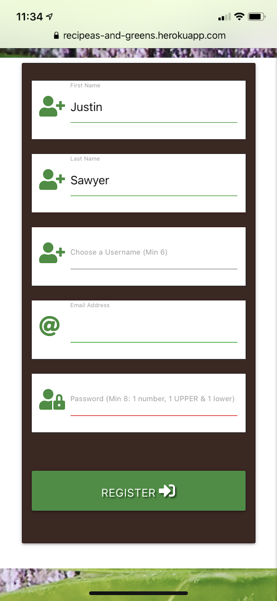
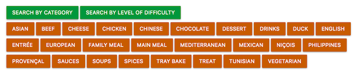

<h1 align="center"><a href="">Recipeas and Greens</a></h1>


This is the website and application for Recipeas and Greens, a database of recipes created by a community of members.

The website is by design simple, and is designed for ease of use. It is primarily targeted towards an audience that has little experience of storing recipes in a web application, preferring up until now to store their "home-made" recipes on paper, or within physical folders.

The website is free to use and recipes are by design exposed (and thus accesible) to the public, the user will need to sign up as a member in order to contribute to the pool of recipes.

## User Experience (UX)

- ### User stories:
    - #### First Time Visitors:
		1) As a first time visitor, I want to see a range of recipes that detail both ingredients and preparation. As a plus, I would like to see the level of difficulty for each particular recipe, its preparation and cooking times, and the category for each recipe.

		2) I want the design of each recipe to be accorded to my particular screen size: 
			- With a large screen such as a desktop or a tablet in a landscape orientation, I would like both ingredients and preparation to be visible together so that I can ensure that I have not missed anything.
			- With smaller screens, such as mobile devices, I want the ordering of items to be logical, thus showing me the ingredients I need to prepare the recipe before the actual text detailing the recipe's preparation.

		3) I want a banner image showing what I should be aiming for with each recipe. The banner image is meant to display the final meal, and also to draw me in and encourage me to both return to the website and join the community.

		4) Upon loading the website, I would like to be presented with the most recently added recipes. I want these recipes to be shown with images, in order to whet my appetite. 

		5) I want the possibility to both search for recipes but also to simply view recipes bsed on their category or level of difficulty via a simple click of buttons. Thus, on the loading page (but not within the navigation) I want to see buttons listing (for example) "Quick and Easy", "Challenging" or "Difficult". On pressing these links, I want to be presented with the most recently uploaded recipes within these criteria. Conversly, if I press the button "Category", I want to be taken to a generic page that list (with images overlaid by the category name) each category. Upon clicking these images, I then want to be taken to a page showing the most recently uploaded recipes within that category.

		6) I want to be encouraged to join the community and thus enter my own recipes for the community to use and enjoy. Although there might not be monetary incentives for joining the community, I would like to to be made clear that there are indeed advantages to joining, such as the possibility to mark recipes as personal favourites. I want this functionality so that I do not have to keep scrolling through a potentially endless list of recipes before finding the recipe I enjoyed preparing (and eating!) last week, last month or last year.

		7) If I decide to join the community, I would like to be able to create my Account. I want the account to be simple, and simple to modify. My Account should not overwhelm me, but should rather contain simple entries for my (first and last) name, a username that I choose, my email address and perhaps a photo of me. While the photo is not obligatory, I understand that having a functioning Account means that including my name, username and email are required for building my personal database of recipes.

		8) If I decide to join the community, I want my list of favourite recipes to be built automatically, by a simple press on an icon such as a "+" or a "heart". I then want these favourited or loved recipes to appear both within my account details, but more importantly, directly from the home page of the website. In other words, I do not want to have to access my Account page before being able to access my favourite recipes.

		9) I want the website to remember me. Once logged in, I want to stay logged in, unless I choose to log out.

		10) If I decide to join the community, I want to be able to add my own recipes. The process must be simple, and I should be prompted how to add ingredients, the preparation method, the category of the recipe, its difficulty level and its preparation and cooking times.

	- #### Returning Visitors:

		1) I want the conditions listed for First Time Visitors to be true also for myself as a Returning Visitor.

		2) If I have not yet joined the community, I would like to be prompted to join upon returning to the website.

		3) As a returning member, I want the navigation of the website to reflect my membership status. Thus, I want to see within the navigation links a link to my Account. My Account page should detail my Account settings (username, etc), recipes I have created, recipes created by others that I have favourited, and recipes that I have not yet tried. I want to be able to mark recipes as favourites from any page I access: the Home page, the Recipe page, the selection of recipes within a category pages, and of course from my own Account page. 

		4) As a returning member, I want to be able to add new recipes, edit previous recipes, edit my Account details if any of these have changed. 

		5) I want to be able to search for recipes based on their name, their ingredients, their category and their ease of preparation. For example, if I return home late from work during a weeknight, I want to be able to search for "Quick and Easy" recipes. Ultimately, I would like to then refine my search to include what I have in my pantry or fridge. Thus while using the search functionality, if I search for "Quick and Easy spaghetti", I would like to be presented with recipes that are both "Quick and Easy" *or* have "spaghetti" as a listed ingredient. These recipes need not be only in my personal favourites, but the search must list all community recipes with these criteria.

		6) Conversely, as a returing member, if I decide that this is a community I no longer want to be a part of, I want the possibility to delete my Account. The deleting process must be simple, but I do not want to be able to delete my Account by accident. Thus, I want to be prompted with an alert, for example, that asks me simply to veify that I do indeed wish to delete my Account. I also want it to be made clear to me that upon clicking "Delete Account", I have the option to delete my Account *and* any recipes I may have created, *or* to delete my Account but leave my recipes online for the community. Both delete options will clear any community recipes from my own personal list of favourites. Thus, if at a later date I decide to rejoin the community, I want it made clear to me on deleting my account that I will have to rebuild my list of favourites as any new community member would.

	- #### Frequent Visitors:
		1) I want the conditions listed for First Time Visitors and Returning Visitors to be true also for myself as a Frequent Visitor.

		2) I want the process of adding new recipes to be "second nature". In other words, unless absolutely necessary, if there is an update to the website, I want the process of uploading new recipes to remain "as is". If there is a neccesity to change the process of adding or editing recipes, I want this change to be virtually invisible (unnoticable) to me as an end user. Thus, I can become what is known as a "power user" with ease.

- ### Design:
    - #### Colour scheme:
		The project uses a simple design, with colours that are designed to make the end user think of food. The website is named "Reci***PEAS*** and ***GREENS***" and thus green is the natural choice for its primary colour. Green is the colour of both most vegetables and most herbs, and is universally known as "Go". Thus the user knows that generally speaking, clicking something green will take the user there. 

		The green is contrasted with brown, which makes the end user think of the warmth of spice and spice mixtures. The brown chosen - the colour of cinnamon - is almost amber, which makes the user think of preparing, just as the amber light in traffic signals tells the driver to prepare to go. Thus, where this cinnamon colour is used, the user knows to either prepare to edit a recipe or the user's Account details.

		Where red is used, the user knows this as a "stop", just as the red in traffic signals does. Thus, red is used for Deleting, and also for removing a recipe from the user's list of favourite recipes. The exception for this is of course where the recipes are in the list of favourites - the natural colour for a badge containing a heart is of course red.

	- #### Typography:
		As the website is aimed towards the generation that uses paper or physical folders to store their personal recipes, the typography must be simple. For this reason, different weights of a single font are preferred over different fonts to discern between titles and text. It is for this reason that the site sticks with the standard font provided by the Materialize framework.

	- #### Imagery:
		Imagery is extremely important on this website. Nothing makes the tongue water more than seeing a beautifully presented meal. The images inspire the end user to both try the recipe, and more importantly, join the community and become an active member.

		Ideally, each recipe page should have the final end meal for that recipe as its banner image. Where this is not possible, the banner image should be an image of the recipe's category (i.e. "Italian" rather than "Quick and Easy").

		Thus, when uploading a recipe to the website, the community member should be prompted to add an image of the prepared meal. 

		For plaigirism reasons, the user is only given the option of uploading images from their device, rather than having the option to search online for images. The user is also asked to provide an image credit.

- ### Wireframes:
	[Landing Pages](https://github.com/Justin-Sawyer/recipeas-and-greens/blob/master/static/documentation/wireframes/landing-pages.png)

	[Categories](https://github.com/Justin-Sawyer/recipeas-and-greens/blob/master/static/documentation/wireframes/categories.png)

	[Level of Difficulty](https://github.com/Justin-Sawyer/recipeas-and-greens/blob/master/static/documentation/wireframes/difficulty-level.png)

	[Individual Recipe Example](https://github.com/Justin-Sawyer/recipeas-and-greens/blob/master/static/documentation/wireframes/recipe.png)

	[Sign Up](https://github.com/Justin-Sawyer/recipeas-and-greens/blob/master/static/documentation/wireframes/sign-up.png)

	[Log In](https://github.com/Justin-Sawyer/recipeas-and-greens/blob/master/static/documentation/wireframes/login.png)

	[Log Out](https://github.com/Justin-Sawyer/recipeas-and-greens/blob/master/static/documentation/wireframes/log-out.png)

	[My Account](https://github.com/Justin-Sawyer/recipeas-and-greens/blob/master/static/documentation/wireframes/my-account.png)

	[Edit My Account](https://github.com/Justin-Sawyer/recipeas-and-greens/blob/master/static/documentation/wireframes/edit-my-account.png)

	[Upload Recipe](https://github.com/Justin-Sawyer/recipeas-and-greens/blob/master/static/documentation/wireframes/upload-recipe.png)

	[Edit Recipe](https://github.com/Justin-Sawyer/recipeas-and-greens/blob/master/static/documentation/wireframes/edit-recipe.png)

	[Delete Recipe](https://github.com/Justin-Sawyer/recipeas-and-greens/blob/master/static/documentation/wireframes/delete-recipe.png)

	[My Recipes](https://github.com/Justin-Sawyer/recipeas-and-greens/blob/master/static/documentation/wireframes/my-recipes.png)

	[My Favourite Recipes](https://github.com/Justin-Sawyer/recipeas-and-greens/blob/master/static/documentation/wireframes/my-favourites.png)

	[Delete My Account](https://github.com/Justin-Sawyer/recipeas-and-greens/blob/master/static/documentation/wireframes/delete-account.png)

## Features:
-	This website is fully responsive and interactive.

## Technologies Used:
- ### Languages:
	[HTML5](https://en.wikipedia.org/wiki/HTML5)

	[CSS](https://en.wikipedia.org/wiki/CSS)

	[JavaScript](https://en.wikipedia.org/wiki/JavaScript)

	[jQuery](https://en.wikipedia.org/wiki/JQuery)

	[JSON](https://en.wikipedia.org/wiki/JSON)

	[Python](https://en.wikipedia.org/wiki/Python_(programming_language))

- ### Frameworks, Libraries & Programs:

	[Markdown Editor](https://iwaki.info/markdown-editor-mac/en/index.html) was used for the writing of this README.md file.

	[Balsamiq](https://balsamiq.com) was used for the creation of the wireframes.

	[Git](https://git-scm.com) was used for version control.

	[GitPod](https://www.gitpod.io/) was used as the writing tool. 

	[GitHub](https://www.gitpod.io/) was used as the repository for the files within this project.

	[Heroku](https://www.heroku.com/home) was used for hosting this project.

	[Preview for Mac](https://support.apple.com/en-gb/guide/preview/welcome/mac) was used for image sizing (height and width), where images are the author's own or were posted by the author.

	[Squash](https://www.realmacsoftware.com/squash/) was used to lighten the weight of image files, where images are the author's own or were posted by the author.

	[Materialize](https://materializecss.com/) forms the vast majority of the formatting code, such as the grid system, containers, buttons, icons etc. 
    It has been heavily modified by the author of this project to suit the website's needs.

	[Font Awesome v4.7.0](https://fontawesome.com/v4.7.0/) was used for the social icons used on this site, since they are so easily recognisable.

	[The Flask Framework](https://flask.palletsprojects.com/en/1.1.x/) was used as a framework.

	The [Werkzeug](https://palletsprojects.com/p/werkzeug/), [flask_paginate](https://pypi.org/project/flask-paginate/), [flask_pymongo](https://pypi.org/project/Flask-PyMongo/) utilities form an integral part of this project, as does [Jinja](https://palletsprojects.com/p/jinja/), the template engine.

	[MongoDB](https://www.mongodb.com/3) was used as the Database host.

	[Cloudinary](https://cloudinary.com/) was used for hosting uploaded recipe and profile images.

## Testing

This website was tested using the following tools:

1. [W3C HTML](https://validator.w3.org/) was used to verify the HTML code:
	* [Results](https://github.com/Justin-Sawyer/recipeas-and-greens/blob/master/static/documentation/validator-results/HTML/)

2. [W3C CSS](https://jigsaw.w3.org/css-validator/) was used to ensure there were no CSS code errors in this project:
	* [Results](https://github.com/Justin-Sawyer/recipeas-and-greens/blob/master/static/documentation/validator-results/CSS/)

3. [JSHint](https://jshint.com/) was used for the verification of the JavaScript:
	* [Results](https://github.com/Justin-Sawyer/recipeas-and-greens/blob/master/static/documentation/validator-results/JS/)

4. [Python Validator](http://pep8online.com/) was used for verification of all Python code:
	* [Results](https://github.com/Justin-Sawyer/recipeas-and-greens/blob/master/static/documentation/validator-results/Python/)

5. Google Chrome's Dev Tool was used extensively while writing this website.

6. The [Lighthouse plugin for Google Chrome](https://chrome.google.com/webstore/detail/lighthouse/blipmdconlkpinefehnmjammfjpmpbjk?hl) was used for speed checking and "tweaking" settings for maximal optimisation for web deployment.
	* [Results (pdf files)](https://github.com/Justin-Sawyer/recipeas-and-greens/blob/master/static/documentation/lighthouse/)

## Code Testing
This project has been a labour of love and has taken many, many hours to complete. Code was tested exhaustively to check for errors and bugs:

### Registration:

The registration template page had a few ugly parts to it. Having told the HTML input code to accept only certain patterns (length of username and password, conditions for email and password), the developer found it prudent to tell the user that the entries would only be accepted if they met these conditions. That is, the username having a minumum of 6 characters, the password having a minimum of 8 characters, which must include a minimum of at least 1 number, 1 uppercase letter and 1 lowercase letter. However, the input text fields did not allow for all of this information.

The developer toyed with the idea of creating a separate `<div>` element to tell the user of these conditions, but felt that the information was best being placed within each label.

First, the developer added separate `<p>` elements after each label, but found the text was not indented:

```
<!-- Choose User Name -->
<div class="row registration" id="username-row">
	<div class="input-field col s12">
		<i class="fas fa-user-plus prefix green-text text-darken-2"></i>
		<input id="username" name="username" type="text" minlength="6" maxlength="24" pattern="^[a-zA-Z0-9]{6,24}$"class="validate" required>
		<label for="username">Choose a Username</label>
		<p>Minimum 6 characters</p>
	</div>
</div>

```


Next, the developer tried adding line breaks within the label:

```
<label for="username">Choose a Username <br><br>Min 6 characters</label>
```

This worked well:


However, when it came to inputting text into the field, the result was not so good:


Additionally, the developer faced problems with rendering the labels on different screen sizes. Below is a screenshot of the password field on a 425px width screen (or, large Mobile screen):


The developer solved these issues through a use of CSS, effectively changing the label font size according to the width of the screen:

```
@media only screen and (max-width: 750px) {
    .input-field>label {
        font-size: 0.8rem;
    }
}

@media only screen and (max-width: 400px) {
    .input-field>label {
        font-size: 0.7rem;
    }
}
```

Here is the result on a 375px wide screen:


The developer then tried to create an Account, however the Autocomplete function for the form then inserted blocks of colour as well as the autocompleted items (in Google Chrome):


As can be seen in the screenshot above, this result was very ugly. To counter this, the developer inserted another block of CSS and added class="registration" to each `row` within the `card-panel`:

```
.registration {
    background-color: white;
}
```

The end result is much more eye-catching, but still renders oddly on different browsers. Google Chrome renders the background in blue, while Safari renders it in yellow:

Chrome:


Safari:


The devloper then looked for a better solution on StackOverflow, and found the following snippet:

```
/* Change the autofill background color 
From https://stackoverflow.com/a/14205976/14773450 */
input:-webkit-autofill,
input:-webkit-autofill:hover, 
input:-webkit-autofill:focus, 
input:-webkit-autofill:active {
    -webkit-box-shadow: 0 0 0 30px white inset !important;
    box-shadow: 0 0 0 30px white inset !important;
}
```

The code was pushed to Git, and the results were almost as expected: the background stays white on both browsers on desktop devices:


However, on iOS, the background color persists. The developer found a further snippet of code on StackOverflow:

```
/* Change the autofill background color Safari iOS 
From https://stackoverflow.com/a/58682412/14773450 */
background-clip: content-box !important;
```

The background now stays white on Safari for iOS when autocomplete is used:



And as can be seen in the last two images above, the "Min x" prompts in the Username and Password fields are nicely formatted, too.

### Recipe Display Order:

While building this website, the developer noticed a few things that were different to the user goals stated in this README file:

Firstly, the categories were displaying in order of creation rather than in reverse order of creation. In other words, the most recently added category was always the last to be seen on the user's device. Thus, if the first Asian recipe was created AFTER the creation of a recipe with a category of Sauces, then the Asian category was being displayed after the Sauces category, and thus seemed out of sequence:


In all the pages where the user can search by category, this was true. The source code for this functionality is:

`categories = list(mongo.db.categories.find())`

A simple addition to the categories variable in the Python source code allows the user to see all the categories in alphabetical order:

`categories = list(mongo.db.categories.find().sort("recipe_category", 1))`



It was decided to simply create a collection of Levels of Difficulty inside of MongoDB itself. Since the three levels (Quick & Easy, Challenging and Difficult) do not have a natural sequence order (for example, they are out of sequence order when sequenced alphabetically) it seemed more logical to create this collection by hand and call these levels as they are within the database:

`levels = list(mongo.db.level_of_difficulty.find())`

Secondly, the recipes were displaying in order of creation rather than in reverse order of creation. In other words, the most recently added recipe was always the last to be seen on the user's device. The stated goal for the ideal user experience was to display the most recently uploaded recipe first, in order that the user is not endlessly scrolling through an ever-growing list of recipes before finding one (s)he has not yet tried.

Since the recipes are being called in essantially the same way as are the categories and difficulty levels (`recipes = list(mongo.db.recipes.find())`), the developer chose to a different `sort()` criteria:

At first, the developer decided that since MongoDB database ids should always be rising in value, a simple "minus 1" sort should suffice:

`recipes = list(mongo.db.recipes.find().sort("_id", -1))`

However, the developer was unsure whether rising id numbers would always be the case. Since the developer has imported the pymongo module from [flask_pymongo](https://pypi.org/project/Flask-PyMongo/), and since this module has a DESCENDING class, using this class should guarantee that if the id sequences ever do change, finding this capitalised class within the code would be easier than finding a -1. Thus, the final code reads:

`recipes = list(mongo.db.recipes.find().sort("_id", pymongo.DESCENDING))`

An alternative to this would be to add a "creation_date" field to the Recipes collection in the database, but since the user doesn't really need to know when a recipe was created in order to make that recipe, the above, simpler solution was favoured.

### Pagination

The developer researched different ways to paginate the recipes that will be displayed on the Home page. In the end, it was decided that using [flask_paginate](https://pypi.org/project/flask-paginate/) would be the simplest option. 

However, [flask_paginate](https://pypi.org/project/flask-paginate/) has a built in setting that needed changing to better suit this website:
		
The built in setting for pagination is that pagination should occur for every tenth item. 

Since this website caters for different width screen sizes and since 10 is not the most divisible of numbers, the user may be confused into thinking (s)he has reached the end of all listed recipes prematurely:

A full size screen shows three recipes in a row before breaking to the next row. Thus, with each page, the user sees three full rows of recipes and then a row with one single recipe. While the user is presented with pagination numbers and arrows both above and below these rows of recipes, to avoid any confusion it was thought best to paginate at 12 recipes. Thus if the users accesses from a mobile (showing one recipe before breaking to the next row), a tablet (showing two or three recipes before breaking, depending on the orientation) or a full size screen (showing 3 before breaking), the only page ever to perhaps not be filled is the very last page. 

Paginating at 12 also allows the developer to change functionality to show 1, 2, 3, 4 or 6 recipes per row before breaking to the next row, should the site grow. At the moment, the developer has chosen larger elements such as recipe images in cards over amount of recipes per screen rendering, as a larger image naturally draws more people in: an image speaks a thousand words, after all.

As can be seen on the [flask-paginate github gist page](https://gist.github.com/mozillazg/69fb40067ae6d80386e10e105e6803c9), the original code reads as follows:

```
users = list(range(100))


def get_users(offset=0, per_page=10):
    return users[offset: offset + per_page]


@app.route('/')
def index():
    page, per_page, offset = get_page_args(page_parameter='page',
                                           per_page_parameter='per_page')
    total = len(users)
    pagination_users = get_users(offset=offset, per_page=per_page)
    pagination = Pagination(page=page, per_page=per_page, total=total,
                            css_framework='bootstrap4')
    return render_template('index.html',
                           users=pagination_users,
                           page=page,
                           per_page=per_page,
                           pagination=pagination,
                           )
```

The developer first changed these code blocks to suit the Recipeas and Greens applicattion: 

```
recipes = list(mongo.db.recipes.find().sort("_id", pymongo.DESCENDING))

def get_all_recipes(offset=0, per_page=10):
    return recipes[offset: offset + per_page]

@app.route("/")
@app.route("/get_recipes")
def get_recipes():
    categories = list(mongo.db.categories.find().sort("recipe_category", 1))
    levels = list(mongo.db.level_of_difficulty.find())

    # recipes = list(mongo.db.recipes.find().sort("_id", pymongo.DESCENDING))

    page, per_page, offset = get_page_args(page_parameter='page',
                                           per_page_parameter='per_page')
    
    total = len(recipes)
    pagination_recipes = get_all_recipes(offset=offset,
                                         per_page=per_page)
    pagination = Pagination(page=page, per_page=per_page, total=total,
                            css_framework='materializecss')

    return render_template("recipes.html",
                           categories=categories,
                           levels=levels,
                           recipes=pagination_recipes,
                           page=page,
                           per_page=per_page,
                           pagination=pagination,
                           title="Home")
```

(Side note: Note the change of css_framework from bootstrap4 to materializecss: Recipeas and Greens is based around [Materialize](https://materializecss.com/) and is not using Bootstrap for this project)

It would have been easy to assume that simply changing the integer in the `get_users()` function would change the pagination number, and this is indeed what the developer tried first:

```
def get_users(offset=0, per_page=12):
    return users[offset: offset + per_page]
```

This however did not change the pagination default. Reading further into the documentation, the developer saw various comments regarding changing this default.

It was [suggested](https://gist.github.com/mozillazg/69fb40067ae6d80386e10e105e6803c9#gistcomment-3110496) firstly to re-assign the `per_page` value: in other words to insert a new `per_page` value inside of the main function. Thus, `per_page = 12` was inserted directly before the `total = len(recipes)` line of code. This however had no effect, the site was still breaking to a new page after every 10th recipe.

Reading further, [another solution was proposed](https://gist.github.com/mozillazg/69fb40067ae6d80386e10e105e6803c9#gistcomment-3236127). The developer again adapted this solution to the code for this application, but was still seeing no difference when rendering the page.

It was through using a combination of these solutions that the developer was able to paginate after every 12th recipe. Beneath is the solution the developer used:

```
recipes = list(mongo.db.recipes.find().sort("_id", pymongo.DESCENDING))

def get_all_recipes(page, offset=0, per_page=10):
    offset = (page-1) * 12
    return recipes[offset: offset + per_page]

@app.route("/")
@app.route("/get_recipes")
def get_recipes():
    categories = list(mongo.db.categories.find().sort("recipe_category", 1))
    levels = list(mongo.db.level_of_difficulty.find())

    # recipes = list(mongo.db.recipes.find().sort("_id", pymongo.DESCENDING))

    page, per_page, offset = get_page_args(page_parameter='page',
                                           per_page_parameter='per_page')
    per_page = 12
    total = len(recipes)
    pagination_recipes = get_all_recipes(page=page,
                                         offset=offset,
                                         per_page=per_page)
    pagination = Pagination(page=page, per_page=per_page, total=total,
                            css_framework='materializecss')

    return render_template("recipes.html",
                           categories=categories,
                           levels=levels,
                           recipes=pagination_recipes,
                           page=page,
                           per_page=per_page,
                           pagination=pagination,
                           title="Home")
```

The develpoer tested this code and indeed, the pagination was working. So, the code was pushed to GitHub.

Everything seemed fine until the developer decided to add a new recipe, to further test the functionality of pagination.

The developer now found that adding a new recipe to the database did not show this new recipe rendered on the page. The developer checked the database, and the recipe had indeed been created. The developer then tried to searech for this new recipe using the search functionality of the application. Upon doing so, the developer found a second problem, which will be discussed in the next point (see "Search", below).

Upon fixing the search functionality (see below), the developer could now access the recipe by its name. So, why was it not showing up in the full list of recipes?

Effectively, calling the `recipes` variable globally was causing the problem: since this variable was being called BEFORE the `get_recipes()` function was run meant that any changes after the function was run were not being reflected in the total amount of recipes. This of course is fine if we are not adding new recipes, and the amount of recipes never changes. But the point of this application is to add new recipes as we discover them, and more importantly, be able to access those new recipes once they are created!

The developer realised he needed to call the `recipes` variable from within the `get_recipes()` function.

He uncommented the recipes variable within the function and then again added a new recipe. Again, this new recipe was not displaying. 

He then realised he needed to find a way for the two functions (`get_all_recipes()` and `get_recipes()`) to call the updated database entries to find the newly uploadeds recipe.

Thus, the developer removed the global recipes variable, kept the local recipes variable (uncommented) and inserted this local variable as an argument to the `get_all_recipes()` function, and also add this local variable to the `pagination_recipes` assignment.

Having done this, full functionality was added to the HTML rendering of the application: recipes were showing as they were created. Deleting recipes also showed the correct database collection length. 

The final code block (showing the commented out global `recipes` variable, which in reality has been deleted from the code):

```
# recipes = list(mongo.db.recipes.find().sort("_id", pymongo.DESCENDING))

def get_all_recipes(recipes, page, offset=0, per_page=10):
    offset = (page-1) * 12
    return recipes[offset: offset + per_page]


@app.route("/")
@app.route("/get_recipes")
def get_recipes():
    categories = list(mongo.db.categories.find().sort("recipe_category", 1))
    levels = list(mongo.db.level_of_difficulty.find())

    recipes = list(mongo.db.recipes.find().sort("_id", pymongo.DESCENDING))

    page, per_page, offset = get_page_args(page_parameter='page',
                                           per_page_parameter='per_page')
    per_page = 12
    total = len(recipes)
    pagination_recipes = get_all_recipes(recipes,
                                         page=page,
                                         offset=offset,
                                         per_page=per_page)
    pagination = Pagination(page=page, per_page=per_page, total=total,
                            css_framework='materializecss')

    return render_template("recipes.html",
                           categories=categories,
                           levels=levels,
                           recipes=pagination_recipes,
                           page=page,
                           per_page=per_page,
                           pagination=pagination,
                           title="Home")
```

### Search

As stated above, while correcting the issue of newly created recipes not being shown, the developer also unearthed a problem with searching.

Since pagination had been introduced, whenever a search was actioned, the user was faced with a jinja templating error, stating the following: `jinja2.exceptions.UndefinedError: 'pagination' is undefined`

The developer realised that this error was being thrown simply because the search() function was rendering the `get_recipes` template:

```
@app.route("/search", methods=["GET", "POST"])
def search():
    query = request.form.get("query")
    categories = list(mongo.db.categories.find().sort("recipe_category", 1))
    levels = list(mongo.db.level_of_difficulty.find())
    recipes = list(mongo.db.recipes.find({"$text": {"$search": query}}))
    return render_template("recipes.html", recipes=recipes,
                           categories=categories, levels=levels,
                           query=query)
```

 The quickest and easiest solution was simply to copy the `recipes.html` page as `search.html`, remove the jinja code blocks `{{ pagination.links }}` (see lines 57 and 135 of `recipes.html`)and divert the search to this newly dedicated HTML page instead of to the Home (ie, recipes) page.

Thus the code was changed and the function rewritten as:

```
@app.route("/search", methods=["GET", "POST"])
def search():
    query = request.form.get("query")
    categories = list(mongo.db.categories.find().sort("recipe_category", 1))
    levels = list(mongo.db.level_of_difficulty.find())
    recipes = list(mongo.db.recipes.find({"$text": {"$search": query}}))
    return render_template("search.html", recipes=recipes,
                           categories=categories, levels=levels,
                           query=query)
```

Search was restored.

### Images (uploading, hosting, displaying of):

An integral part of Reipeas and Greens is of course its imagery. All budding chefs want to show off their creations. This of course means that some form of image hosting would be necessary for Recipeas and Greens. 

At first, the developer contemplated using the same Database for image hosting. The developer researched hosting files on MongoDB and was able to adapt some code found in [this video by Pretty Printed](https://www.youtube.com/watch?v=DsgAuceHha4) and was able to upload image files to Mongo. 

The Python code :

```
@app.route("/add_recipe", methods=["GET", "POST"])
def add_recipe():
    if request.method == "POST":
        if "recipe_image" in request.files:
            recipe_image = request.form.get["recipe_image_url"]
            mongo.save_file(recipe_image.filename, recipe_image)

		recipe = {
			"image_url": recipe_image.filename,
			# 'other_keys': request.form.get("other_values")
			}

		mongo.db.recipes.insert(recipe)


@app.route("/file/<filename>")
def file(filename)
	return mongo.send_file(filename)


@app.route("/recipe/<recipe_id>")
def recipe(recipe_id):
    recipe = mongo.db.recipes.find_one({"_id": ObjectId(recipe_id)})
    return render_template("recipe.html", recipe=recipe)
```

The HTML code:

``

This worked as intended: files were indeed being uploaded to MongoDB, and then were displayed on the associated recipe page.

This was, however, very rudimentary, and had one big drawback to it: The image files' weights and sizes were not being reduced, meaning that displaying the image in the HTML page was taking a long time. 

The developer was thus faced with a choice. Either:
1) Ask users to resize their photos before uploading them
2) Write some custom JavaScript to resize the photos
3) Find an alternative solution

As stated in the opening paragraphs of this README file, this application is meant for those with very little experience of the possibilities the internet may offer. The developer knows that if he asked (for example) his parents to resize a photo, he would be met with blank stares, and an even blanker refusal to use this application! Thus the first option was immediately discounted.

The developer started to tentatively explore writing some JavaScript code to resize images before upload, but while researching this, the developer discovered [Cloudinary](https://cloudinary.com/), the Media Optimizer, designed to facilitate the hosting and displaying of images.

Thus the developer turned his attention to Cloudinary. Cloudinary offers many ways to upload images, whether through jQuery, JavaScript, Django or others. While at first the developer was tempted to use one of these SDKs, he then thought it would be a nice challenge to instead learn a little about how to integrate Cloudinary with his own code, or rather, code learned from another [video source, Learn with Coffee](https://www.youtube.com/watch?v=6uHfIv4981U)

The developer used a block of the HTML code from the associated [Learn With Coffee Upload To Cloudinary GitHub repo](https://github.com/itsdevcoffee/cloudinary-image-upload):

```

<label class="file-upload-container" for="file-upload">
	<input id="file-upload" type="file" style="display:none;">	Select an Image
</label>

<!-- Script to handle upload -->
<script src="https://unpkg.com/axios/dist/axios.min.js"></script>
```

That code block was adapted so:

```

<label class="file-upload-container btn btn-block green darken-2 white-text" for="file-upload">
	<input id="file-upload" type="file" name="recipe_image_url" style="display:none;"> 
	Add Photo <i class="fas fa-camera"></i>
</label>
```


He then followed along with the video lesson to create the JavaScript for uploading to Cloudinary, adapting it of course to his needs:

```
var imgPreview = document.getElementById("img-preview");
var fileUpload = document.getElementById("file-upload");

fileUpload.addEventListener("change", function(event) {
    var file = event.target.files[0];
    var formData = new FormData();
    formData.append("file", file);
    formData.append("upload_preset", CLOUDINARY_UPLOAD_PRESET);

    axios({
        url: CLOUDINRY_URL,
        method: "POST",
        headers: {
            "Content-Type": "application/x-www-form-urlencoded"
        },
        data: formData
    }).then(function(res) {
        console.log(res.data.secure_url);
        imgPreview.src = res.data.secure_url;
        fileUpload.value = res.data.secure_url;
    }).catch(function(err) {
        console.log(err);
    });
});
```
After checking that this worked, the developer then added the HTML block as and where needed (Add Recipe, Edit Recipe, Edit Profile), and then checked settings in Cloudinary to ensure that images were being resized.

Indeed, images were being uploaded to Cloudinary and were resized, however, the image urls were not being added to MongoDB.

To do so, an extra line of HTML was needed, and both the JavaScript file and the Pythoncode needed to be tweaked.

The HTML:

```

<label class="file-upload-container btn btn-block green darken-2 white-text" for="file-upload">
	<input id="file-upload" type="file" name="recipe_image_url" style="display:none;">
	Add Photo <i class="fas fa-camera"></i>
</label>

<!-- Extra line of code -->
<input id="file-upload1" type="hidden" name="recipe_image_url" style="display:none;">
```

The JavaScript:

```
var imgPreview = document.getElementById("img-preview");
var fileUpload = document.getElementById("file-upload");

# Extra line of code
var fileUpload1 = document.getElementById("file-upload1");

fileUpload.addEventListener("change", function(event) {
    var file = event.target.files[0];
    var formData = new FormData();
    formData.append("file", file);
    formData.append("upload_preset", CLOUDINARY_UPLOAD_PRESET);

    axios({
        url: CLOUDINRY_URL,
        method: "POST",
        headers: {
            "Content-Type": "application/x-www-form-urlencoded"
        },
        data: formData
    }).then(function(res) {
        console.log(res.data.secure_url);
        imgPreview.src = res.data.secure_url;

	# Extra line of code:
        fileUpload1.value = res.data.secure_url;
    }).catch(function(err) {
        console.log(err);
    });
});
```
The Python:

```
@app.route("/add_recipe", methods=["GET", "POST"])
def add_recipe():
    if request.method == "POST":
	""" Code no longer needed:
        if "recipe_image" in request.files:
            recipe_image = request.form.get["recipe_image_url"]
            mongo.save_file(recipe_image.filename, recipe_image)
	"""

	recipe = {
		"image_url": request.form.get("recipe_image_url"),
		# 'other_keys': request.form.get("other_values")
		}

	mongo.db.recipes.insert(recipe)
```

Why these extra lines of code? Effectively, the Python code as written just above was working correctly, but instead of entering the new Cloudinary url into the database, it had nothing to read (no `value` in the first `<input>` block). Thus, a `None` value was being entered in the `image_url` field. A second, hidden `<input>` block was needed to catch the url itself. It is this value that is being read in the JavaScript as `fileUpload1.value = res.data.secure_url`. This value is inserted into the second `<input> `field, and is then fed to MongoDB.

Finally, an alert was added to the JavaScript EventListener, to tell users that their image is being added.

### Recipes Without Images

The developer of course realises that people may not actually posess an image on their device of the recipe they want to add. 

Without adding an image, both the recipe cards and the recipe pages had standard blank image placeholders:


To counter for this, a little Jinja templating was added where needed, either in the recipe banner image or the recipe's card image:

```

	

	

```
### Deleting Account:

While the code for deleting an Account is relatively straighforward, the developer nonetheless came across an interesting problem while testing the functionality.

The developer discovered that if he were to create an Account, then delete it and then create a new Account using the same "credentials", all previous recipes created by the first Account, as well as any recipes the first Account had lsited as favourites were automatically attributed to this new Account.

The original delete Account code block:

```
@app.route("/delete_account")
def delete_account():
	user = mongo.db.users.find_one(
        	{"username": session["user"]})["_id"]

	mongo.db.users.delete_one({"_id": ObjectId(user)})

	session.pop("user")

	return redirect(url_for("get_recipes"))
```

This situation was arising as the site uses two database collections within MongoDB. One collection for the site's users, named `users`, and one for the recipes posted to the site, named `recipes`.

When a user creates an Account, the user is asked for their first and last names, a username and their email address (as well as a password). These vales are passed into the `users` collection as the user's document.

When that user then adds a recipe, that recipe is credited to the user's username within the `recipes` collection. 

Since we are able to connect different collections in a database, the developer thought that for simplicity, the `users` collection did not need to be updated with each new recipe created in the `recipes` collection.

Given this, the developer was thus faced with a question regarding Account deletions: does Recipeas and Greens allow for one single use of a username - in other words, is a record kept of a username even if the user using that username deletes the associated Account - or can Recipeas and Greens allow for users to (re)create an Account using a username that had been previously taken? (The application only allows for one user to use the same username at a time currently.)

While setting up the application, the developer discussed the needs of this site with friends, family and other developers. It became clear to the developer that in terms of *privacy*, it was better to keep no record of anything the user has created when that user deleted the Account, **unless the user specified otherwise when that user deletes their Account**.

The block of code above is *only* deleting the Account itself, and is not touching upon any other collection in the database. The `recipes` collection, in other words, is being left intact.

This of course means that a username *can* be reused if that username is no longer taken. With the code block as written above, it means that if that username is taken anew, and the previous user has not *personally* deleted their published recipes and their community favourite recipes, then these are automatically attributed to the new user taking that previously used username.

To counter this, new code needed to be written, and that code needs to take into account the previous user's preferences.

Thus, when choosing to delete an Account, the user is asked what (s)he wishes to happen with the recipes the user has created, and any community recipes the user has marked as a favourite.

Since we are allowing the reuse of previously taken usernames, clearly all recipes marked as favourites of the previous user need to be "un-favourited". The user deleting an Account is told that this will be the case. When choosing to delete the Account, the user is given a popup. In that popup, is the follwing text:

**Community Recipeas you have added as favourites will be "un-favourited".**

And thus, the `delete_account()` function needs to be amended:

```
@app.route("/delete_account")
def delete_account():
	# Get user:
	username = mongo.db.users.find_one(
        {"username": session["user"]})["username"]

	# Get recipes:
	recipes = mongo.db.recipes

	# Mark favourites as no longer favourites:
	existing_favourite_of = {"favourite_of": username}
	remove_favourite_of = {"$pull": {"favourite_of": username}}
	recipes.update_many(existing_favourite_of, remove_favourite_of)

	# Delete account:
	user = mongo.db.users.find_one(
        {"username": session["user"]})["_id"]
	mongo.db.users.delete_one({"_id": ObjectId(user)})

	# Remove cookie:
	session.pop("user")

	return redirect(url_for("get_recipes"))
```

Again, the above code *only* deals with favourites. Since we are asking the user to make a choice regarding their published recipes, we need to address what the site should do if that user decides to delete the Account but leave their published recipes online and available for the community as a whole. Because, otherwise, when that username is taken anew, the previous username's recipes will be attributed to this new username. 

To counter this, we need therefore to re-attribute any recipes concerned to a "Former Member".

Again, new text needed to be added to clarify this when a user follows the link to delete the Account:

**Delete your account but keep your Recipeas online:**

**This action is best if you want the Recipeas and Greens community to still have access to Recipeas that you have published. Recipeas will be credited to "Former Member". Community Recipeas you have added as favourites will be "un-favourited".**

And, of course, we again need to amend the `delete_account()` function:

```
@app.route("/delete_account")
def delete_account():
	# Get user:
	username = mongo.db.users.find_one(
        {"username": session["user"]})["username"]

	# Get recipes:
	recipes = mongo.db.recipes

	# Mark favourites as no longer favourites:
	existing_favourite_of = {"favourite_of": username}
	remove_favourite_of = {"$pull": {"favourite_of": username}}
	recipes.update_many(existing_favourite_of, remove_favourite_of)

	# Re-credits all recipes created by the user as "created by Former Member"
	existing_created_by = {"created_by": session["user"]}
	recredited_created_by = {"$set": {"created_by": "Former Member"}}
	recipes.update_many(existing_created_by, recredited_created_by)

	# Delete account:
	user = mongo.db.users.find_one(
        {"username": session["user"]})["_id"]
	mongo.db.users.delete_one({"_id": ObjectId(user)})

	# Remove cookie:
	session.pop("user")

	return redirect(url_for("get_recipes"))
```

To test this, the developer then created an Account using a different username to his own. He then added [this recipe](http://recipeas-and-greens.herokuapp.com/recipe/607aeac3f71a25091a3f33c5) to the application.

As can be seen in the image below, the Added By field reflects the developer's chosen username:


The developer then deleted said Account and returned to the recipe. The Added By field had indeed changed:


The developer then created a new account using the same username, and then looked in the profile page to ensure that this recipe was not showing up as his:


The developer then chose some recipes as favourites and did the same thing; delete and recreate account to check the functionality.

While member and having chosen a favourite:


After Account deletion then recreation of Account in same username:


Everything was working as expected.

However, this does not of course take in to account what happens if a user decides to delete the Account *and* any recipes the user may have created while a member.

To do so, a new function was needed, based very much on the existing `delete_account()` function:

```
@app.route("/delete_account")
def delete_account():
	# Get user:
	username = mongo.db.users.find_one(
        {"username": session["user"]})["username"]

	# Get recipes:
	recipes = mongo.db.recipes

	# Mark favourites as no longer favourites:
	existing_favourite_of = {"favourite_of": username}
	remove_favourite_of = {"$pull": {"favourite_of": username}}
	recipes.update_many(existing_favourite_of, remove_favourite_of)

	# Re-credits all recipes created by the user as "created by Former Member"
	existing_created_by = {"created_by": session["user"]}
	recredited_created_by = {"$set": {"created_by": "Former Member"}}
	recipes.update_many(existing_created_by, recredited_created_by)

	# Delete all recipes created by the user
	created_by = {"created_by": session["user"]}
	recipes.delete_many(created_by)

	# Delete account:
	user = mongo.db.users.find_one(
        {"username": session["user"]})["_id"]
	mongo.db.users.delete_one({"_id": ObjectId(user)})

	# Remove cookie:
	session.pop("user")

	return redirect(url_for("get_recipes"))
```

These two functions were then renamed as `remove_all_from_favourites_and_delete_account()` and `remove_all_from_favourites_and_delete_recipes_and_delete_account()` and their routes were changed accordingly.

The developer then added further HTML to the deleting functionality of the `profile.html` page, to reflect that the user could now choose what to do when deleting their Account:

```
<!-- Delete account? modal -->
<div class="col s12">
    <div id="delete-account-modal" class="modal">
        <div class="modal-content">
            <h4>Are you sure you want to delete your account and no longer be part of the Recipeas and Greens community?</h4>
            <p><strong>Please choose one of the following options:</strong></p>
            <p>1: Delete your account but keep your Recipeas online</p>
            
            <a href="{{ url_for('remove_all_from_favourites_and_delete_account')}}" class="btn edit-buttons red">
                Delete Account Only <i class="fas fa-trash-alt right"></i></a>
            
            <p>(This action is best if you want the Recipeas and Greens community to still have access to Recipeas that you have published. 
                Recipeas will be credited to "Former Member".
                Community Recipeas you have added as favourites will be "un-favourited".</p>
                
            <p>If you decide later to return to the Recipeas and Greens community, you will not be able to edit any Recipeas that you created previsouly, 
                since those Recipeas are now credited to "Former Member" rather than to your username. And since any community Recipeas you have previously 
                added as favourites will be removed from your list of favourites, you will need to rebuilt your list of favourites by clicking their green 
                "+" badges.)</p>

            <hr>
            
            <p>2: Delete your account and remove your Recipeas</p>
            
            <a href="{{ url_for('remove_all_from_favourites_and_delete_recipes_and_delete_account')}}" class="btn edit-buttons red">
                Delete Account And Recipeas <i class="fas fa-trash-alt right"></i></a>
            
            <p>(This action is best if you want to delete everything you posted to the Recipeas and Greens community.)</p>

            <hr>
            
            <p>3: Do not delete your account</p>
            <a href="#!" class="btn edit-buttons modal-close green darken-2">Do Not Delete <i class="fas fa-times-circle right"></i></a>
        </div>
    </div>
</div>
```

Thus, when a user now deletes their Account, said user can choose what to do with any information the user has shared:

Either delete everything, or leave recipes online but no longer credited to that user.

### Password Reset:

Having been locked out of the user Account a couple of times, the developer decided that it would be a very good idea to add a "reset password" functionality to the project.

The developer first added a simple form input to the Edit Profile page that was designed to take the value of the hashed password set in the user collection's document password entries (displayed as dots, rather than being exposed as text):

```
<div class="input-field">
    <input id="password" name="password" value="{{user.password}}" type="password" minlength="8" maxlength="24" pattern="^(?=.*\d)(?=.*[a-z])(?=.*[A-Z]).{8,24}$">
    <label for="password">Change Password</label>
</div>
```

Upon testing, he then discovered that when he edited his Account, an updated value was being inserted into the password field: a newly hashed hash of the password hash. The developer discovered this by changing the `type` value to "text" rather than "password".

Each time he edited the account, a new (hashed but text) value was being returned. 

The developer then decided to remove the `value` value into the code block above (thus: `value=""`).

He thus discovered that since the `value` string was empty, he could not update the password, as the empty string did not follow the `pattern` value. 

The developer also concluded that if he were able to update the value and then change the password to an empty string (by leaving the field empty), he might possibly get a hashed value of an empty string, or a Null value for the password.

Clearly, another way to reset a password was needed.

Having been locked out of his Account, the developer first tried for a "Forgot Password" functionality, where a user can signal that (s)he has forgotten their password, receive an email and reset the password via that email. This functionality has been removed from the current version of this application, as the developer had too many problems trying to get this to work. However, the developer does intend to include this funcionality in the future: see the Future PLans section.

However, even though the functionality has been removed from this version of the application, it is worth discussing the code used here in the Testing section:

The developer researched the use of tokens for this functionality. Specifically, time expiring tokens that send a user to a reset link, if the url including the token is clicked on within the specified time limit.

The developer looked to the "itsdangerous" module that is included when Flask is imported. In that module is a class called "TimedJSONWebSignatureSerializer" which was imported as Serializer.

While the developer was able to set a time-out to a token within the CLI, he could never seem to get the token to expire when used outside of the CLI.

Within the CLI, the developer used this code to test the time out functionality:

```
from itsdangerous import TimedJSONWebSignatureSerializer as Serializer
s = Serializer('secret', 30)
token = s.dumps({'user_id': 1}).decode('utf-8')
token
```

This returned a multi-character string of random values. Then, again within the CLI, the devloper typed 

`s.loads(token)`

which returned, as it should, the following dictionary:

`{'user_id': 1}`

The developer then waited for 30 seconds to elapse, and then tried again using 

`s.loads(token)`

An error was returned, signalling that the token had indeed expired.

Thus, the developer assumed that everything was set for using this within the application.

The developer wrote the following blocks of code, and was able to send an email with a url string containing the token to himself:

```
def get_reset_token(existing_email, expires_sec=30):
    s = Serializer(app.config['SECRET_KEY'], expires_sec)
    return s.dumps({'user_id': existing_email}).decode('utf-8')


def verify_reset_token(token, existing_email):
    s = Serializer(app.config['SECRET_KEY'])
    try:
        user_id = s.loads(token)['user_id']
    except:
        return None
    return existing_email.query.get(user_id)


def send_password_reset_email(existing_email):
    token = get_reset_token(existing_email)
    msg = Message('Password Reset Request',
                  sender='recipeasandgreens@gmail.com',
                  recipients=[existing_email])
    msg.body = f'''To reset your password, visit the following link:
{url_for('reset_token', token=token, _external=True)}
If you did not make this request then simply ignore this email
and no changes will be made.
'''
    mail.send(msg)
    print(existing_email)
    print(token)
    register = {
            "email": existing_email,
            "token": token
        }
    mongo.db.password_reset.insert_one(register)


@app.route('/reset_password_request', methods=['GET', 'POST'])
def reset_password_request():
    if request.method == "POST":
        existing_email = mongo.db.users.find_one(
            {"email": request.form.get("email")})['email']
        if existing_email:
            # print(existing_email)
            # print(token)
            send_password_reset_email(existing_email)
        flash('Check your email for the instructions to reset your password')
        return redirect(url_for('login'))
    return render_template('reset_password_request.html',
                           title='Reset Password')


@app.route('/reset_token/<token>', methods=['GET', 'POST'])
def reset_token(token):
    print(token)
    if request.method == "POST":
        existing_email = mongo.db.users.find_one(
                {"email": request.form.get("email")})['email']
        print(existing_email)
        token_email = mongo.db.password_reset.find_one(
                {"email": request.form.get("email")})["email"]
        print(token_email)
        get_token = mongo.db.password_reset.find_one(
                {"email": request.form.get("email")})["token"]
        print(get_token)
        if token == get_token and existing_email == token_email:
            session["user"] = request.form.get("username").lower()
            flash("Click Edit to change your password!")
            mongo.db.password_reset.remove({"token": get_token})
            return redirect(url_for("profile", username=session["user"]))
        if TypeError:
            return redirect(url_for('login'))
    return render_template('reset_token.html', token=token)
```

The above code has been adapted by the developer from a [video series](https://coreyms.com/development/python/python-flask-tutorials-full-series) about Flask, and is very much a first draft proof of concept rather than any eventual code that might have been used, had he persisted.

Accompanying HTML pages were also written with password reset forms, and a password_reset collection was added to the Database, and the datetime module was of course imported.


While the proof of concept does function, as can be seen above, the simple fact that the token did not time out pusuaded the developer that further development of this functionality was like heading down a rabbit hole: perhaps more trouble that it is worth, seeing as this is his first Python project. 

The developer also questioned the security of the code he had written: since defensive programming is the ideal, the developer needs to be 100% certain that the code he writes *is* indeed secure. While the developer knows full well that the code he wrote above is not at this level, he realised that more research was needed in order to guarantee secure coding.

The developer intends on learning Django, and knows that in Django there is a package called "allauth" that is designed specifically for this use case. The developer will thus return to this problem as soon as he has mastered Django!

The developer then turned to getting the password reset functionality to work while signed in.

He decided that it would be better to have a separate form for updating the password, rather than including this in a general "edit Account" form. Doing so guaranteees that passwords are not changed by accident.

He thus built a new HTML page dedicated solely to this purpose:

```
<form class="col s12 m8" method="POST" action="{{ url_for('reset_password') }}">
    <div class="card-panel cinnamon">

        <!-- Confirm Login User Name -->
        <div class="row registration" id="username-row">
            <div class="input-field col s12">
                <i class="fas fa-user-cog prefix green-text text-darken-2"></i>
                <input id="username" name="username" type="text" minlength="6" maxlength="24" pattern="^[a-zA-Z0-9]{6,24}$" class="validate" required >
                <label for="username">Confirm User Name</label>
            </div>
        </div>

        <!-- Enter Old Password -->
        <!-- pattern="" from W3Schools.com https://www.w3schools.com/tags/att_input_pattern.asp-->
        <div class="row registration" id="password-row">
            <div class="input-field col s12">
                <i class="fas fa-user-lock prefix green-text text-darken-2"></i>
                <input id="password" name="password" type="password" minlength="8" maxlength="24" pattern="^(?=.*\d)(?=.*[a-z])(?=.*[A-Z]).{8,24}$" class="validate" required>
                <label for="password">Enter Current Password</label>
            </div>
        </div>

        <!-- Enter New Password -->
        <!-- pattern="" from W3Schools.com https://www.w3schools.com/tags/att_input_pattern.asp-->
        <div class="row registration" id="new-password-row">
            <div class="input-field col s12">
                <i class="fas fa-user-lock prefix green-text text-darken-2"></i>
                <input id="new_password" name="new_password" type="password" minlength="8" maxlength="24" pattern="^(?=.*\d)(?=.*[a-z])(?=.*[A-Z]).{8,24}$" class="validate" required>
                <label for="new_password">Enter New Password</label>
            </div>
        </div>

        <!-- Confirm New Password -->
        <!-- pattern="" from W3Schools.com https://www.w3schools.com/tags/att_input_pattern.asp-->
        <div class="row registration" id="confirm-new-password-row">
            <div class="input-field col s12">
                <i class="fas fa-user-lock prefix green-text text-darken-2"></i>
                <input id="confirm_new_password" name="confirm_new_password" type="password" minlength="8" maxlength="24" pattern="^(?=.*\d)(?=.*[a-z])(?=.*[A-Z]).{8,24}$" class="validate" required>
                <label for="confirm_new_password">Confirm New Password</label>
            </div>
        </div>

        <!-- Confirm Change Submit Button -->
        <div class="row" id="submit-button">
            <button type="submit" class="col s12 btn-large register-button green darken-2">
                Change Password <i class="fas fa-check-double"></i>
            </button>
        </div>
    </div>
</form>

```

Although the user is of course signed in before being able to access this page, the developer thought it a good idea to ask the user to supply his or her username. Both the username *and* the **current** password are checked before the user is able to change the password for a new one.

The following Python code was written to accompany this HTML:

```
@app.route("/reset_password", methods=["GET", "POST"])
def reset_password():
    if request.method == "POST":
        # Check if username exists in Database
        existing_user = mongo.db.users.find_one(
            {"username": request.form.get("username")})

        new_password = request.form.get("new_password")
        confirm_new_password = request.form.get("confirm_new_password")

        if existing_user:
            # Ensure hashed password matches user input
            if check_password_hash(
              existing_user["password"], request.form.get("password")):
		        # Re-enforce retention of new password
                if new_password == confirm_new_password:
                    password = generate_password_hash(
                                request.form.get("new_password"))
                    mongo.db.users.update_one(
                        existing_user,
                        {"$set": {
                            "password": password}})
                    flash("Your password has been changed, {}" .format(
                        request.form.get("username")))
                    return redirect(url_for("profile",
                                    username=session["user"]))
                else:
		            # If new and confirm new passwords mismatch
                    flash("Did your passwords match?")
                    return redirect(url_for("reset_password"))
            else:
                # Invalid password match
                flash("Incorrect Username and/or Password")
                return redirect(url_for("profile", username=session["user"]))

        else:
            # Username doesn't exist
            flash("Incorrect Username and/or Password")
            return redirect(url_for("login"))

    if session["user"]:
        return render_template(
            "reset_password.html")

    return render_template("reset_password.html")
```

To recap on this code:

It is only if a user is signed in (and there is thus a cookie) that the user can access this page.

If the user is signed in and thus the username exists, the user confirms the username and password associated with the Account. If the username does not exist, the user is redirected to the login page. If the password does not match the password that is stored in the user's document in the database, the user is alerted that one of the two does not match. Again, for security against abuse, the user is not informed *which one* does not match.

If the cookie exists, and the username and password match, the code then looks to see whether the new password value matches the confirm password value. If they do not, the user is asked whether they match.

If they do match, and all other conditions have been met, the databse is then updated with the new password value.

The code was tested and the developer was able to confirm the functionality of thus code by both inserting incorrect and correct values in each field.

Having then tested that this code works, the developer then inserted an extra "confirm password" field in the register.html page and associated code in the register Python function. This confirm password field is designed to re-enforce memory retention of the user's password when a user creates an account.

As an aisde, the developer believes that it is the developer's role to create code where, should the user forget the login details, then the users should be able to securely recover their credentials. It is not the developers role to force a user to memorise said credentials. It is precisely because of this that the "Forgot Password" functionality will be added as soon as the developer is able to do so.

