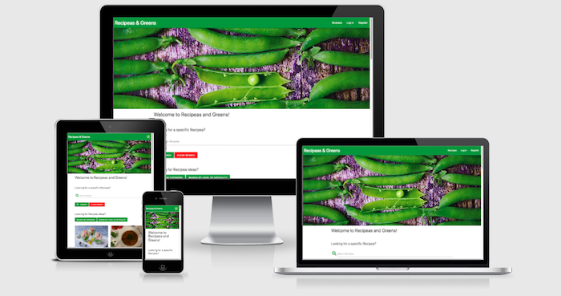

<h1 align="center"><a href="">Recipeas and Greens</a></h1>



This is the website and application for Recipeas and Greens, a database of recipes created by a community of members.

The website is by design simple, and is designed for ease of use. It is primarily targeted towards an audience that has little experience of storing recipes in a web application, preferring up until now to store their "home-made" recipes on paper, or within physical folders.

The website is free to use and recipes are by design exposed (and thus accesible) to the public, the user will need to sign up as a member in order to contribute to the pool of recipes.

## User Experience (UX)

- ### User stories:
    - #### First Time Visitors:
		1) As a first time visitor, I want to see a range of recipes that detail both ingredients and preparation. As a plus, I would like to see the level of difficulty for each particular recipe, its preparation and cooking times, and the category for each recipe.

		2) I want the design of each recipe to be accorded to my particular screen size: 
			- With a large screen such as a desktop or a tablet in a landscape orientation, I would like both ingredients and preparation to be visible together so that I can ensure that I have not missed anything.
			- With smaller screens, such as mobile devices, I want the ordering of items to be logical, thus showing me the ingredients I need to prepare the recipe before the actual text detailing the recipe's preparation.

		3) I want a banner image showing what I should be aiming for with each recipe. The banner image is meant to display the final meal, and also to draw me in and encourage me to both return to the website and join the community.

		4) Upon loading the website, I would like to be presented with the most recently added recipes. I want these recipes to be shown with images, in order to whet my appetite. 

		5) I want the possibility to both search for recipes but also to simply view recipes bsed on their category or level of difficulty via a simple click of buttons. Thus, on the loading page (but not within the navigation) I want to see buttons listing (for example) "Quick and Easy", "Challenging" or "Difficult". On pressing these links, I want to be presented with the most recently uploaded recipes within these criteria. Conversly, if I press the button "Category", I want to be taken to a generic page that list (with images overlaid by the category name) each category. Upon clicking these images, I then want to be taken to a page showing the most recently uploaded recipes within that category.

		6) I want to be encouraged to join the community and thus enter my own recipes for the community to use and enjoy. Although there might not be monetary incentives for joining the community, I would like to to be made clear that there are indeed advantages to joining, such as the possibility to mark recipes as personal favourites. I want this functionality so that I do not have to keep scrolling through a potentially endless list of recipes before finding the recipe I enjoyed preparing (and eating!) last week, last month or last year.

		7) If I decide to join the community, I would like to be able to create my Account. I want the account to be simple, and simple to modify. My Account should not overwhelm me, but should rather contain simple entries for my (first and last) name, a username that I choose, my email address and perhaps a photo of me. While the photo is not obligatory, I understand that having a functioning Account means that including my name, username and email are required for building my personal database of recipes.

		8) If I decide to join the community, I want my list of favourite recipes to be built automatically, by a simple press on an icon such as a "+" or a "heart". I then want these favourited or loved recipes to appear both within my account details, but more importantly, directly from the home page of the website. In other words, I do not want to have to access my Account page before being able to access my favourite recipes.

		9) I want the website to remember me. Once logged in, I want to stay logged in, unless I choose to log out.

		10) If I decide to join the community, I want to be able to add my own recipes. The process must be simple, and I should be prompted how to add ingredients, the preparation method, the category of the recipe, its difficulty level and its preparation and cooking times.

	- #### Returning Visitors:

		1) I want the conditions listed for First Time Visitors to be true also for myself as a Returning Visitor.

		2) If I have not yet joined the community, I would like to be prompted to join upon returning to the website.

		3) As a returning member, I want the navigation of the website to reflect my membership status. Thus, I want to see within the navigation links a link to my Account. My Account page should detail my Account settings (username, etc), recipes I have created, recipes created by others that I have favourited, and recipes that I have not yet tried. I want to be able to mark recipes as favourites from any page I access: the Home page, the Recipe page, the selection of recipes within a category pages, and of course from my own Account page. 

		4) As a returning member, I want to be able to add new recipes, edit previous recipes, edit my Account details if any of these have changed. 

		5) I want to be able to search for recipes based on their name, their ingredients, their category and their ease of preparation. For example, if I return home late from work during a weeknight, I want to be able to search for "Quick and Easy" recipes. Ultimately, I would like to then refine my search to include what I have in my pantry or fridge. Thus while using the search functionality, if I search for "Quick and Easy spaghetti", I would like to be presented with recipes that are both "Quick and Easy" *or* have "spaghetti" as a listed ingredient. These recipes need not be only in my personal favourites, but the search must list all community recipes with these criteria.

		6) Conversely, as a returing member, if I decide that this is a community I no longer want to be a part of, I want the possibility to delete my Account. The deleting process must be simple, but I do not want to be able to delete my Account by accident. Thus, I want to be prompted with an alert, for example, that asks me simply to veify that I do indeed wish to delete my Account. I also want it to be made clear to me that upon clicking "Delete Account", I have the option to delete my Account *and* any recipes I may have created, *or* to delete my Account but leave my recipes online for the community. Both delete options will clear any community recipes from my own personal list of favourites. Thus, if at a later date I decide to rejoin the community, I want it made clear to me on deleting my account that I will have to rebuild my list of favourites as any new community member would.

	- #### Frequent Visitors:
		1) I want the conditions listed for First Time Visitors and Returning Visitors to be true also for myself as a Frequent Visitor.

		2) I want the process of adding new recipes to be "second nature". In other words, unless absolutely necessary, if there is an update to the website, I want the process of uploading new recipes to remain "as is". If there is a neccesity to change the process of adding or editing recipes, I want this change to be virtually invisible (unnoticable) to me as an end user. Thus, I can become what is known as a "power user" with ease.

- ### Design:
    - #### Colour scheme:
		The project uses a simple design, with colours that are designed to make the end user think of food. The website is named "Reci***PEAS*** and ***GREENS***" and thus green is the natural choice for its primary colour. Green is the colour of both most vegetables and most herbs, and is universally known as "Go". Thus the user knows that generally speaking, clicking something green will take the user there. 

		The green is contrasted with brown, which makes the end user think of the warmth of spice and spice mixtures. The brown chosen - the colour of cinnamon - is almost amber, which makes the user think of preparing, just as the amber light in traffic signals tells the driver to prepare to go. Thus, where this cinnamon colour is used, the user knows to either prepare to edit a recipe or the user's Account details.

		Where red is used, the user knows this as a "stop", just as the red in traffic signals does. Thus, red is used for Deleting, and also for removing a recipe from the user's list of favourite recipes. The exception for this is of course where the recipes are in the list of favourites - the natural colour for a badge containing a heart is of course red.

	- #### Typography:
		As the website is aimed towards the generation that uses paper or physical folders to store their personal recipes, the typography must be simple. For this reason, different weights of a single font are preferred over different fonts to discern between titles and text. It is for this reason that the site sticks with the standard font provided by the Materialize framework.

	- #### Imagery:
		Imagery is extremely important on this website. Nothing makes the tongue water more than seeing a beautifully presented meal. The images inspire the end user to both try the recipe, and more importantly, join the community and become an active member.

		Ideally, each recipe page should have the final end meal for that recipe as its banner image. Where this is not possible, the banner image should be an image of the recipe's category (i.e. "Italian" rather than "Quick and Easy").

		Thus, when uploading a recipe to the website, the community member should be prompted to add an image of the prepared meal. 

		For plaigirism reasons, the user is only given the option of uploading images from their device, rather than having the option to search online for images. The user is also asked to provide an image credit.

- ### Wireframes:
	[Landing Pages](https://github.com/Justin-Sawyer/recipeas-and-greens/blob/master/static/documentation/wireframes/landing-pages.png)

	[Categories](https://github.com/Justin-Sawyer/recipeas-and-greens/blob/master/static/documentation/wireframes/categories.png)

	[Level of Difficulty](https://github.com/Justin-Sawyer/recipeas-and-greens/blob/master/static/documentation/wireframes/difficulty-level.png)

	[Individual Recipe Example](https://github.com/Justin-Sawyer/recipeas-and-greens/blob/master/static/documentation/wireframes/recipe.png)

	[Sign Up](https://github.com/Justin-Sawyer/recipeas-and-greens/blob/master/static/documentation/wireframes/sign-up.png)

	[Log In](https://github.com/Justin-Sawyer/recipeas-and-greens/blob/master/static/documentation/wireframes/login.png)

	[Log Out](https://github.com/Justin-Sawyer/recipeas-and-greens/blob/master/static/documentation/wireframes/log-out.png)

	[My Account](https://github.com/Justin-Sawyer/recipeas-and-greens/blob/master/static/documentation/wireframes/my-account.png)

	[Edit My Account](https://github.com/Justin-Sawyer/recipeas-and-greens/blob/master/static/documentation/wireframes/edit-my-account.png)

	[Upload Recipe](https://github.com/Justin-Sawyer/recipeas-and-greens/blob/master/static/documentation/wireframes/upload-recipe.png)

	[Edit Recipe](https://github.com/Justin-Sawyer/recipeas-and-greens/blob/master/static/documentation/wireframes/edit-recipe.png)

	[Delete Recipe](https://github.com/Justin-Sawyer/recipeas-and-greens/blob/master/static/documentation/wireframes/delete-recipe.png)

	[My Recipes](https://github.com/Justin-Sawyer/recipeas-and-greens/blob/master/static/documentation/wireframes/my-recipes.png)

	[My Favourite Recipes](https://github.com/Justin-Sawyer/recipeas-and-greens/blob/master/static/documentation/wireframes/my-favourites.png)

	[Delete My Account](https://github.com/Justin-Sawyer/recipeas-and-greens/blob/master/static/documentation/wireframes/delete-account.png)

## Features:
-	This website is fully responsive and interactive.

## Technologies Used:
- ### Languages:
	[HTML5](https://en.wikipedia.org/wiki/HTML5)

	[CSS](https://en.wikipedia.org/wiki/CSS)

	[JavaScript](https://en.wikipedia.org/wiki/JavaScript)

	[jQuery](https://en.wikipedia.org/wiki/JQuery)

	[JSON](https://en.wikipedia.org/wiki/JSON)

	[Python](https://en.wikipedia.org/wiki/Python_(programming_language))

- ### Frameworks, Libraries & Programs:

	[Markdown Editor](https://iwaki.info/markdown-editor-mac/en/index.html) was used for the writing of this README.md file.

	[Balsamiq](https://balsamiq.com) was used for the creation of the wireframes.

	[Git](https://git-scm.com) was used for version control.

	[GitPod](https://www.gitpod.io/) was used as the writing tool. 

	[GitHub](https://www.gitpod.io/) was used as the repository for the files within this project.

	[Heroku](https://www.heroku.com/home) was used for hosting this project.

	[Preview for Mac](https://support.apple.com/en-gb/guide/preview/welcome/mac) was used for image sizing (height and width), where images are the author's own or were posted by the author.

	[Squash](https://www.realmacsoftware.com/squash/) was used to lighten the weight of image files, where images are the author's own or were posted by the author.

	[Materialize](https://materializecss.com/) forms the vast majority of the formatting code, such as the grid system, containers, buttons, icons etc. 
    It has been heavily modified by the author of this project to suit the website's needs.

	[Font Awesome v4.7.0](https://fontawesome.com/v4.7.0/) was used for the social icons used on this site, since they are so easily recognisable.

	[The Flask Framework](https://flask.palletsprojects.com/en/1.1.x/) was used as a framework.

	The [Werkzeug](https://palletsprojects.com/p/werkzeug/), [flask_paginate](https://pypi.org/project/flask-paginate/), [flask_pymongo](https://pypi.org/project/Flask-PyMongo/) utilities form an integral part of this project, as does [Jinja](https://palletsprojects.com/p/jinja/), the template engine.

	[MongoDB](https://www.mongodb.com/3) was used as the Database host.

	[Cloudinary](https://cloudinary.com/) was used for hosting uploaded recipe and profile images.

## Testing

This website was tested using the following tools:

1. [W3C HTML](https://validator.w3.org/) was used to verify the HTML code:
	* [Results](https://github.com/Justin-Sawyer/recipeas-and-greens/blob/master/static/documentation/validator-results/HTML/)

2. [W3C CSS](https://jigsaw.w3.org/css-validator/) was used to ensure there were no CSS code errors in this project:
	* [Results](https://github.com/Justin-Sawyer/recipeas-and-greens/blob/master/static/documentation/validator-results/CSS/)

3. [JSHint](https://jshint.com/) was used for the verification of the JavaScript:
	* [Results](https://github.com/Justin-Sawyer/recipeas-and-greens/blob/master/static/documentation/validator-results/JS/)

4. [Python Validator](http://pep8online.com/) was used for verification of all Python code:
	* [Results](https://github.com/Justin-Sawyer/recipeas-and-greens/blob/master/static/documentation/validator-results/Python/)

5. Google Chrome's Dev Tool was used extensively while writing this website.

6. The [Lighthouse plugin for Google Chrome](https://chrome.google.com/webstore/detail/lighthouse/blipmdconlkpinefehnmjammfjpmpbjk?hl) was used for speed checking and "tweaking" settings for maximal optimisation for web deployment.
	* [Results (pdf files)](https://github.com/Justin-Sawyer/recipeas-and-greens/blob/master/static/documentation/lighthouse/)

## Code Testing
This project has been a labour of love and has taken many, many hours to complete. Code was tested exhaustively to check for errors and bugs:

### Registration:

The registration template page had a few ugly parts to it. Having told the HTML input code to accept only certain patterns (length of username and password, conditions for email and password), the developer found it prudent to tell the user that the entries would only be accepted if they met these conditions. That is, the username having a minumum of 6 characters, the password having a minimum of 8 characters, which must include a minimum of at least 1 number, 1 uppercase letter and 1 lowercase letter. However, the input text fields did not allow for all of this information.

The developer toyed with the idea of creating a separate `<div>` element to tell the user of these conditions, but felt that the information was best being placed within each label.

First, the developer added separate `<p>` elements after each label, but found the text was not indented:

```
<!-- Choose User Name -->
<div class="row registration" id="username-row">
	<div class="input-field col s12">
		<i class="fas fa-user-plus prefix green-text text-darken-2"></i>
		<input id="username" name="username" type="text" minlength="6" maxlength="24" pattern="^[a-zA-Z0-9]{6,24}$"class="validate" required>
		<label for="username">Choose a Username</label>
		<p>Minimum 6 characters</p>
	</div>
</div>

```


Next, the developer tried adding line breaks within the label:

```
<label for="username">Choose a Username <br><br>Min 6 characters</label>
```

This worked well:


However, when it came to inputting text into the field, the result was not so good:


Additionally, the developer faced problems with rendering the labels on different screen sizes. Below is a screenshot of the password field on a 425px width screen (or, large Mobile screen):


The developer solved these issues through a use of CSS, effectively changing the label font size according to the width of the screen:

```
@media only screen and (max-width: 750px) {
    .input-field>label {
        font-size: 0.8rem;
    }
}

@media only screen and (max-width: 400px) {
    .input-field>label {
        font-size: 0.7rem;
    }
}
```

Here is the result on a 375px wide screen:


The developer then tried to create an Account, however the Autocomplete function for the form then inserted blocks of colour as well as the autocompleted items (in Google Chrome):


As can be seen in the screenshot above, this result was very ugly. To counter this, the developer inserted another block of CSS and added class="registration" to each `row` within the `card-panel`:

```
.registration {
    background-color: white;
}
```

The end result is much more eye-catching, but still renders oddly on different browsers. Google Chrome renders the background in blue, while Safari renders it in yellow:

Chrome:


Safari:


The devloper then looked for a better solution on StackOverflow, and found the following snippet:

```
/* Change the autofill background color 
From https://stackoverflow.com/a/14205976/14773450 */
input:-webkit-autofill,
input:-webkit-autofill:hover, 
input:-webkit-autofill:focus, 
input:-webkit-autofill:active {
    -webkit-box-shadow: 0 0 0 30px white inset !important;
    box-shadow: 0 0 0 30px white inset !important;
}
```

The code was pushed to Git, and the results were almost as expected: the background stays white on both browsers on desktop devices:


However, on iOS, the background color persists. The developer found a further snippet of code on StackOverflow:

```
/* Change the autofill background color Safari iOS 
From https://stackoverflow.com/a/58682412/14773450 */
background-clip: content-box !important;
```

The background now stays white on Safari for iOS when autocomplete is used:


And as can be seen in the last two images above, the "Min x" prompts in the Username and Password fields are nicely formatted, too.

### Recipe Display Order:

While building this website, the developer noticed a few things that were different to the user goals stated in this README file:

Firstly, the categories were displaying in order of creation rather than in reverse order of creation. In other words, the most recently added category was always the last to be seen on the user's device. Thus, if the first Asian recipe was created AFTER the creation of a recipe with a category of Sauces, then the Asian category was being displayed after the Sauces category, and thus seemed out of sequence:


In all the pages where the user can search by category, this was true. The source code for this functionality is:

`categories = list(mongo.db.categories.find())`

A simple addition to the categories variable in the Python source code allows the user to see all the categories in alphabetical order:

`categories = list(mongo.db.categories.find().sort("recipe_category", 1))`


It was decided to simply create a collection of Levels of Difficulty inside of MongoDB itself. Since the three levels (Quick & Easy, Challenging and Difficult) do not have a natural sequence order (for example, they are out of sequence order when sequenced alphabetically) it seemed more logical to create this collection by hand and call these levels as they are within the database:

`levels = list(mongo.db.level_of_difficulty.find())`


